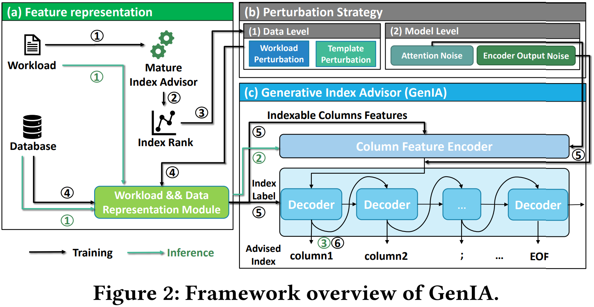

# GenIA
Generative Index Advising for Dynamic HTAP Workloads and Data


### Code structure
├── config.json　　　　　　　　　　　　　　　　　　 # Experimental Configuration File  
├── README.md　　　　　　　　　　　　　　　　　　   # Code Documentation  
├── requirements.txt　　　　　　　　　　　　　　　  # Experimental Requirements File  
├── main.py　　　　　　　　　　　　　　　　　　　   # Main Process File  
├── model.py　　　　　　　　　　　　　　　　　　　  # GenIA Model File  
├── data_process.py　　　　　　　　　　　　　　　　 # Process data
├── planTree.py　　　　　　　　　　　　　　　　　　 # Plan Encoding  
├── log　　　　　　　　　　　　　　　　　　　　     # Log File  
├── psql　　　　　　　　　　　　　　　　　　　　      
│　　├── PostgreSQL.py　　　　　　　　　　　　     # Interact with psql  
└── pth　　　　　　　　　　　　　　　　　					     # save the model               
│　　├── tpch                     
│　　├── tpcds                      
│　　├── chbenchmark                      
└── resource　　　　　　　　　　　　　　　　			    # Training data and other useful json file             
　　 ├── tpch              
　　 ├── tpcds                  
　　 └── chbenchmark 
 
### Example workflow

```
pip install -r requirements.txt         # Install requirements with pip
python main.py					        # Run a experiment
```

Experiments can be controlled with the **config.json** file. For descriptions of the components and functioning, consult our paper.


### JSON Config files

All experimental hyperparameter configurations are stored in the **config.json** file. In the following, we explain the different configuration options:

* **device ( int )** : Specifies the graphics card to run on.
* **epoch_num ( int )** : Specify the epochs of model training.
* **batch_size ( int )** : Specify the batch sizes of model training.
* **dataset ( str )** : Select the dataset for the experiment, optional types are tpch/tpcds/chbenchmark.
* **batch_train_epoch ( int )** : Specifies the number of times the learning rate accumulates during training.
* **batch_valid_epoch ( int )** : Specifies the number of workloads for the test set.
* **layer_numer ( int )** : Specifies the number of layers of the model.
* **distribution_dim ( int )** : Specifies the dimensions of the histogram.
* **flag_train ( int )** : Specify whether to train.
* **flag_test ( int )** : Specify whether to test.
* **psql_connect** : Configure the parameters for connecting to a psql database.
  * **pg_ip ( str )** : The name of the psql database to be connected.
  * **pg_port ( str )** : The port number of the psql database to be connected.
  * **pg_user ( str )** : The username of the psql database to be connected.
  * **pg_password ( str )** : The password for the username of the psql database to be connected.
